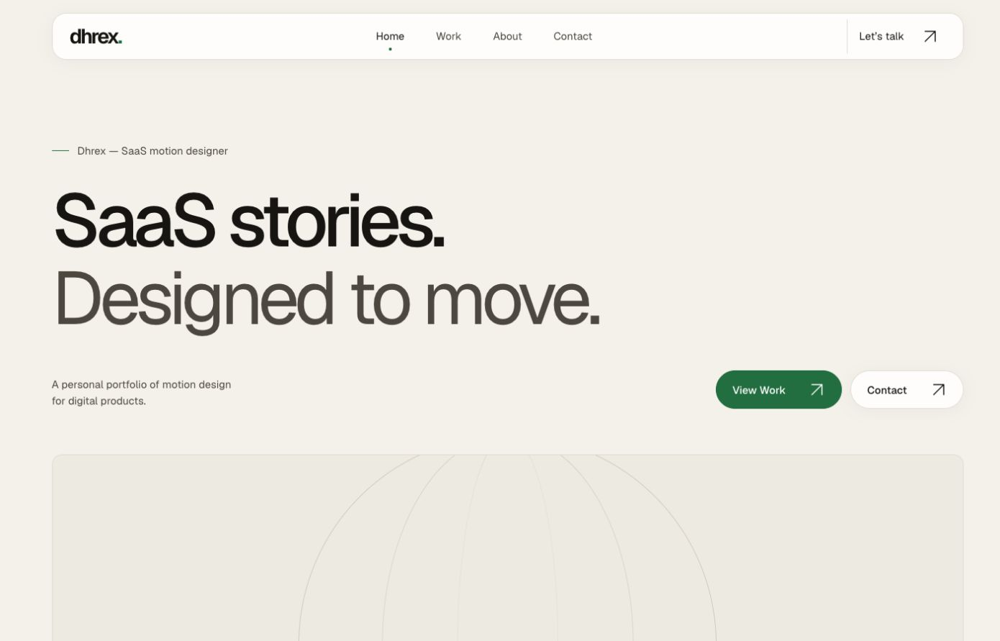
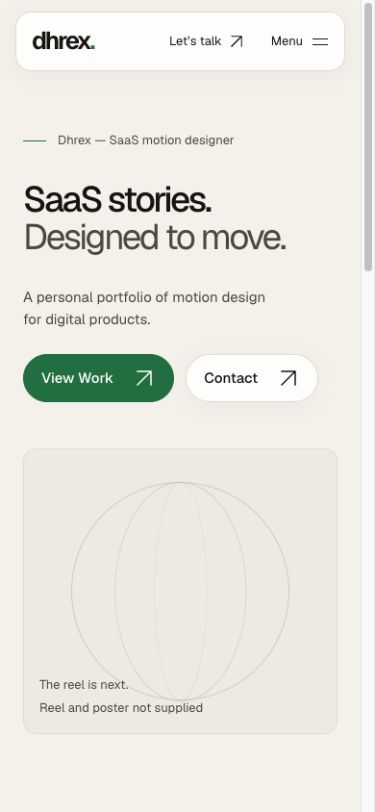

# Phase 2 — visual foundation

Completed 2026-10-04 on `implementation/phase-1-experience-plan`. No production merge or deploy command.

## Implemented

- Home, Work, `/work/project-template`, About, Contact and 404; reusable template and data-driven static project routes.
- Persistent frosted navigation, native responsive mobile disclosure, active route indicators, footer/contact access, ordinary anchor navigation.
- Geist variable typography; Bayad paper/white surfaces, dark text, sparse green, 4px spacing rhythm, rounded controls, fine borders and quiet depth.
- Central typography, colour, spacing, glass, radius, focus, button and container tokens. Opaque glass base when backdrop support is absent; opaque overrides for reduced transparency/increased contrast.
- No advanced motion, external media, stock imagery, fake credentials, client names, testimonials, project results or contact backend.
- Licensed self-hosted font; original SVG/favicon and labelled CSS media placeholders; asset inventory and hosting documentation.

## Verified

- `npm run build`: six independent static documents; output `dist`; no server entrypoint, adapter or functions.
- `npm run check`: zero errors, warnings or hints.
- `PREVIEW_URL=http://127.0.0.1:4321 npm test`: six tests passing. Checks static routes, internal links/assets/fonts, missing-content labels, absence of server output, text/button contrast >= 4.5:1 on opaque surfaces, HTTP direct loads and a real 404.
- Production preview browser review: all five content routes at 1440×900 and 390×844; additional 320×740 overflow audit found no horizontal overflow on any route. Contact stays visible in the header.
- Home View Work → Work → case-study template; browser Back/Forward; template refresh; keyboard Enter opens mobile menu; Escape closes it and returns focus to summary; visible green focus outline; mobile Work navigation.
- Static HTTP responses contain headings, content and native disclosure navigation before JavaScript. JavaScript is enhancement for dismissal only, not required for page content/routing/menu expansion. JavaScript-disabled browser emulation was not available.
- Glass fallback verified in CSS; unsupported-backdrop and reduced-transparency browser environments were not emulated. No physical-device or full automated accessibility audit claimed.

Initial checks found a missing Arrow import and insufficient caption contrast on the darker fill token; both fixed. Narrow-screen header contact text also refined to stay on one line.

## Outstanding content

Reel/poster/captions, 3–4 approved projects and their real assets/roles/results, Bayad screenshots, portrait, biography, verified email/social links. Template preview is noindex. Contact clearly states it is not accepting messages until a verified address is added. Play Reel is omitted until there is a real film.

## Hosting limitation

The static production build is compatible with Cloudflare Pages' Astro build settings (`npm run build`, `dist`, Node 24). Existing account settings cannot be independently confirmed without Cloudflare sign-in. Owner confirmed branch isolation to previews in this chat. A failed Workers integration existed before Phase 2; do not infer that Pages is configured from a Workers check. Report a remote preview only after it succeeds and can be loaded.

## Visual evidence

